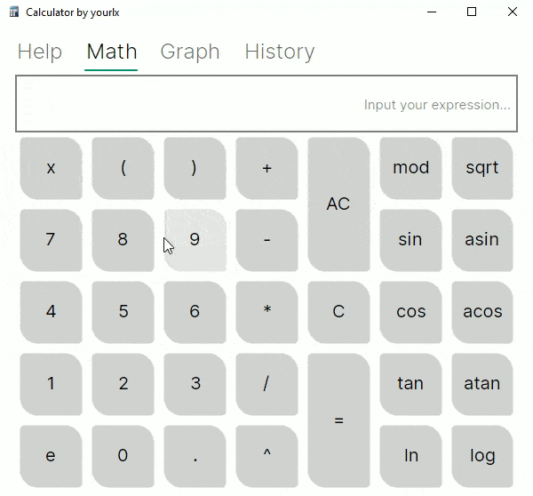
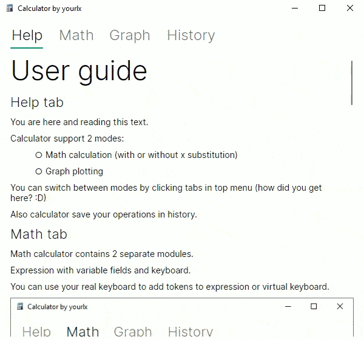

Desktop Calculator
============

This is a project to get acquainted with Avalonia UI and the use of C++ dynamic libraries.

Calculator allows you to evaluate arithmetic expressions and build graphs.

## Features

All features that available to user are explained in "Help" tab in UI. You can see
content [here](./src/Calculator.Application/Assets/Help/Help.md)

## Running application

Running from CLI:

***Install .NET 7***

> cd src/Calculator.Application \
> dotnet restore \
> dotnet run

## Libraries and Frameworks used in this project

- Avalonia UI
- Markdown.Avalonia
- Community Toolkit MVVM
- Microsoft Dependency Injection
- LiveCharts 2
- NUnit

## License

This repository code is under MIT License. See [LICENSE file](LICENSE) for more info.
