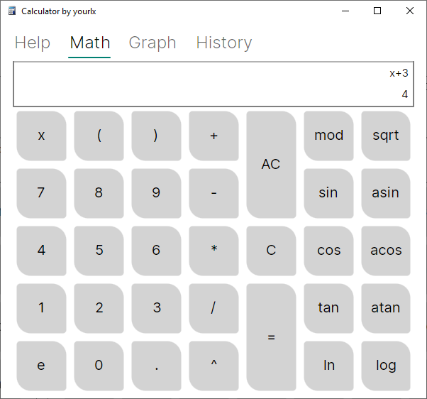
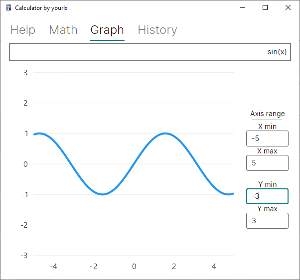
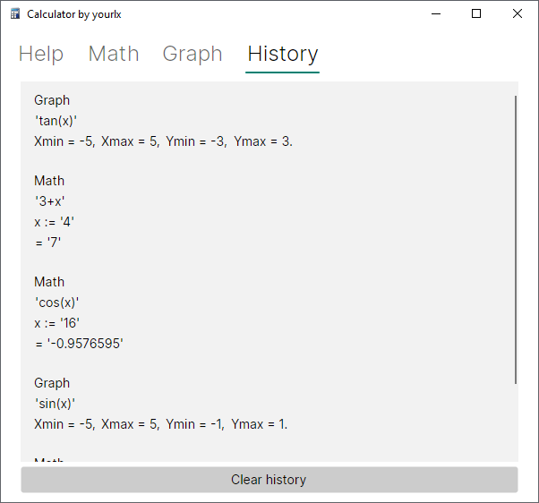

# User guide

## Help tab

You are here and reading this text.

Calculator support 2 modes:

- Math calculation (with or without *x* substitution)
- Graph plotting

You can switch between modes by clicking tabs in top menu (how did you get here? :D)

Also calculator save your operations in history.

## Math tab

Math calculator contains 2 separate modules.

Expression with variable fields and keyboard.

You can use your real keyboard to add tokens to expression or virtual keyboard. 

Variable field only pop-up when you have CORRECT expression with *x*.

In variable field you allow to write only floating point number, in expression field you allowed to write anything less
than 255 symbols.

Supported numbers:

- whole numbers (2, 3, 4, 5)
- floating point numbers (1.5, 1.3, 19.000002)
- exponential notation numbers (1e-6, 2e+3)
- variable *x* with substitution

Supported operators:

- unary '+' and '-'
- binary '-', '+', '*', '/', 'mod', '^'
- brackets '(' and ')'

Supported functions:

- sin
- asin
- cos
- acos
- tan
- atan
- ln
- log
- sqrt

## Graph tab

You can build graph of any function `y = f(x)`.

Example of `sin(x)` plot with x = [-5; 5] and y [-3;3] below:

## History tab

All you operations and math calc or graph mode will be saved here.

Max buffer limited to 100 records.

You can click to any record and it will redirect you to corresponding tab. Also copying all values.

